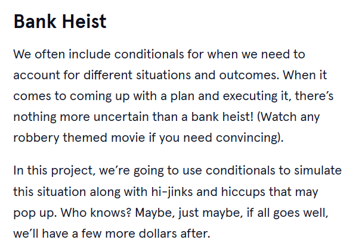
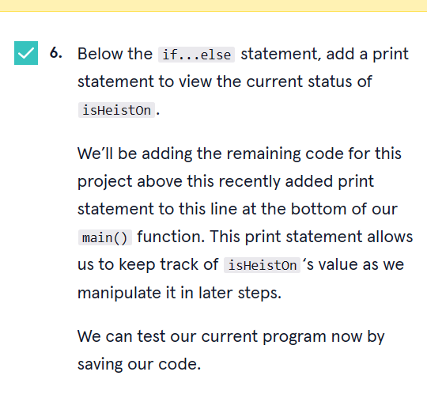

<a type="button" title="Codecademy_Learn_Go_Course_button" href="https://www.codecademy.com/courses/learn-go/projects/bank-heist" target="_blank" data-CodecademyLearnGoCourseButt="CodecademyLearnGoCourseButt_data"></a>

<br><br>

# Bank Heist
<br>

# 1. Introduction:

<br>
<br>

# 2. Output:
> 

> 

> 

> 

> 

<br>
<br>

# 3. Prompts:


```go
var isHeistOn bool = true
eludedGuards:= rand.Intn(100)
```


```go
if eludedGuards >= 50 {
    fmt.Println("Looks like you've managed to make it past the guards. Good job, but remember, this is the first step.")
}
```


```go
if eludedGuards >= 50 {
    fmt.Println("Looks like you've managed to make it past the guards. Good job, but remember, this is the first step.")
  }else{
    isHeistOn = false
     fmt.Println("Plan a better disguise next time?")
}
```



```go
  fmt.Println(isHeistOn)
```


```go
  openedVault:=rand.Intn(100)
```


```go
if isHeistOn == true && openedVault >=70 {
    fmt.Println("Grab and Go!")
}else if isHeistOn == true && openedVault < 70 {
    isHeistOn = false
    fmt.Println("The vault can't be opened.")
}
```


```go
  leftSafely:= rand.Intn(5)
```


```go
if isHeistOn == true {
    switch leftSafely {
        case 0:
            isHeistOn = false
            fmt.Println("failed heist!!!")
        case 1:
            isHeistOn = false
            fmt.Println("Turns out vault doors don't open from the inside...")
        case 2:
            isHeistOn = false
            fmt.Println("Turns out vault doors don't open from the inside...")
        case 3:
            isHeistOn = false
            fmt.Println("Turns out vault doors don't open from the inside...")
        default:
            fmt.Println("Start the getaway car!")
    }

    if isHeistOn {
      amtStolen:= 10000 + rand.Intn(1000000)
      fmt.Println("$",amtStolen,"not bad!")

    }
}
```


