<a type="button" title="Codecademy_Learn_Go_Course_button" href="https://www.codecademy.com/courses/learn-go-loops-arrays-maps-and-structs/projects/catnapped" target="_blank" data-CodecademyLearnGoCourseButt="CodecademyLearnGoCourseButt_data"></a>

<br><br>

# Catnapped
<br>

# 1. Introduction:
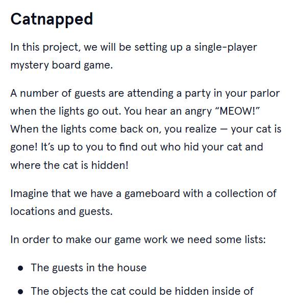
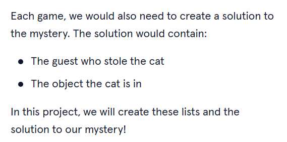
<br>
<br>

# 2. Output:
> Guest List:  [David Guetta Armin Van Buuren Jauz]

> Storage Objects:  [A Toy Chest A Crate A Box]

> Armin Van Buuren hid the cat by putting it in the A Toy Chest
<br>
<br>

# 3. Prompts:
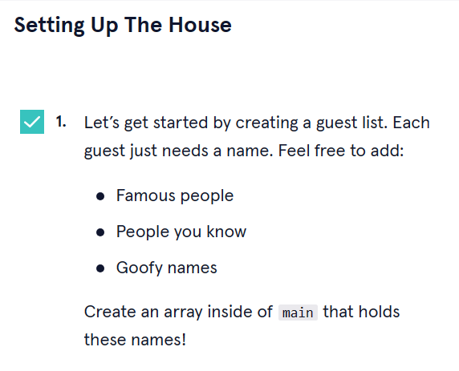
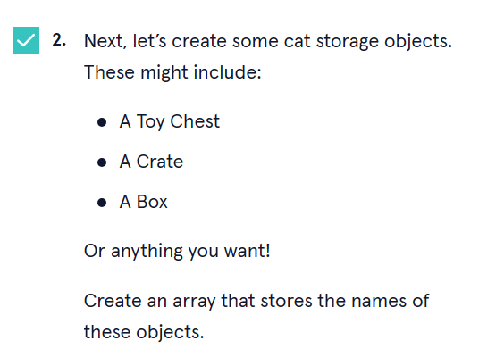

```go
 guestList := []string{"David Guetta","Armin Van Buuren","Jauz"}
 storageObjects := []string{"A Toy Chest","A Crate","A Box"}
```

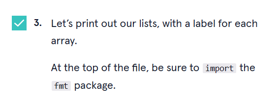
```go
fmt.Println("Guest List: ",guestList)
fmt.Println("Storage Objects: ",storageObjects)
```

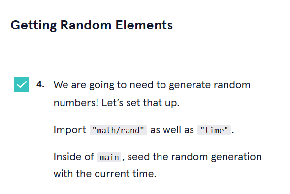
```go
import (
  "fmt"
  "math/rand"
  "time"
)

//Inside 'main' function add syntaxes below to the start of the function:
 rand.Seed(time.Now().UnixNaNo())
```
> In Go latest verison, rand.Seed() is not required. It is automatically set to the current time.

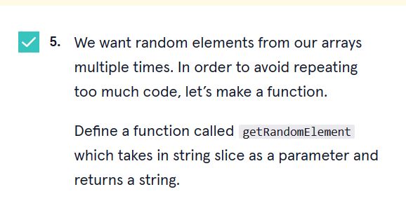
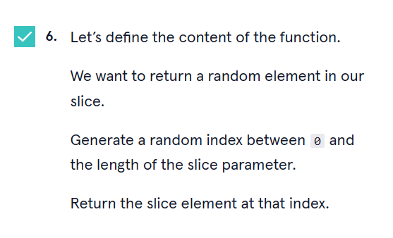
```go
func getRandomElement(array []string) string {
  randomVal := rand.Intn(len(array))
   return array[randomVal]
}
```

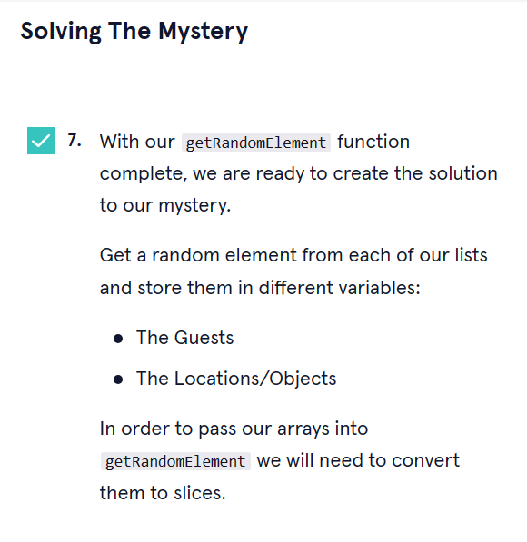
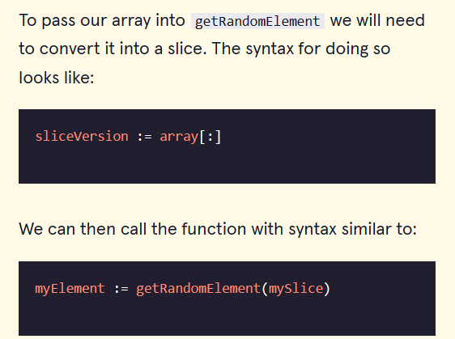
```go
guestListSlice := guestList[:]
storageObjectsSlice := storageObjects[:]
var Guest string = getRandomElement(guestListSlice)
var Location_Objects string = getRandomElement(storageObjectsSlice)
```
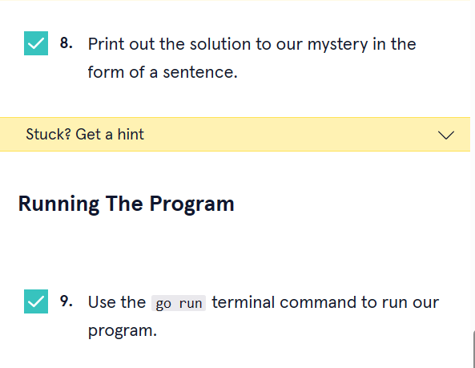
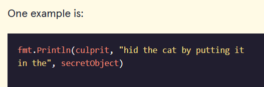


