<a type="button" title="Codecademy_Learn_Go_Course_button" href="https://www.codecademy.com/courses/learn-go/projects/comic-mischief" target="_blank" data-CodecademyLearnGoCourseButt="CodecademyLearnGoCourseButt_data"></a>

<br><br>

# Comic Mischief
<br>

# 1. Introduction:
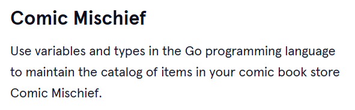
<br>
<br>

# 2. Output:
> Mr.GoToSleep written by Tracey Hatchet , drawn by Jewel Tampson , published by DizzyBooks Publishing Inc. in 1997 with the number of 14 pages is scoring 6.5

>Epic Vol. 1 written by Ryan N. Shawn , drawn by Phoebe Paperclips , published by DizzyBooks Publishing Inc. in 2013 with the number of 160 pages is scoring 9

<br>
<br>

# 3. Prompts:

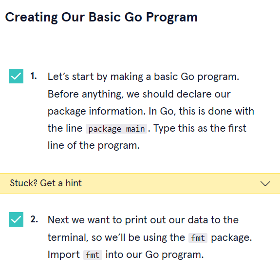
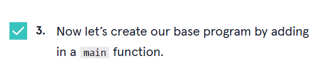
```go
package main
import "fmt"
func main(){
  
}
```
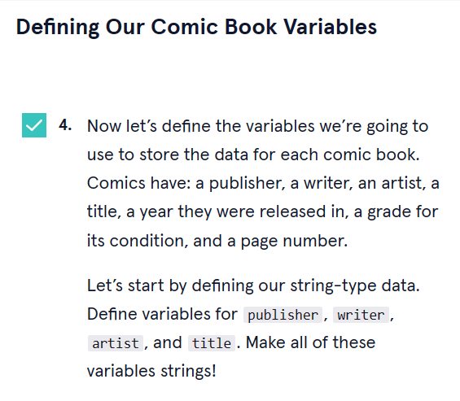
```go
  var publisher, writer, artist, title string

```
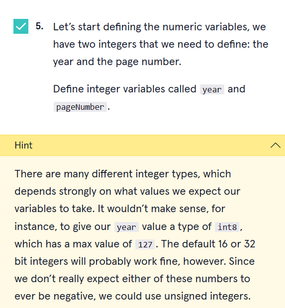
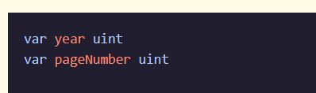
```go
  var year, pageNumber uint

```


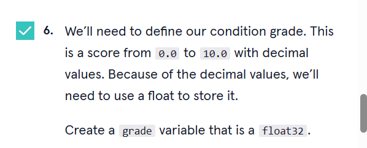
```go
  var grade float32
```


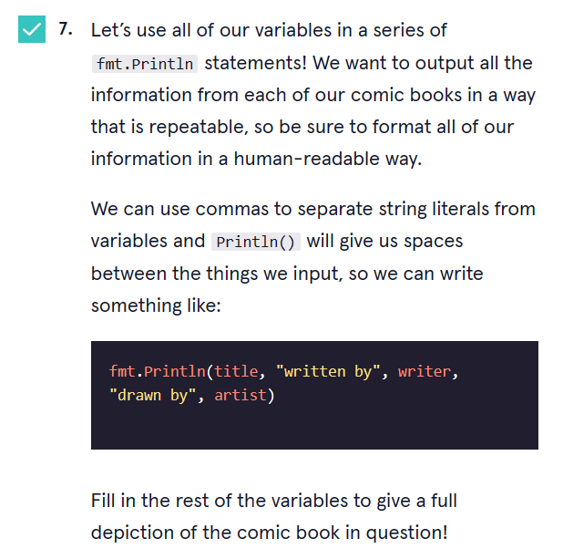
```go
fmt.Println(title,"written by",writer,", drawn by",artist,", published by",publisher,"in",year,"with the number of",pageNumber,"pages","is scoring",grade)
```

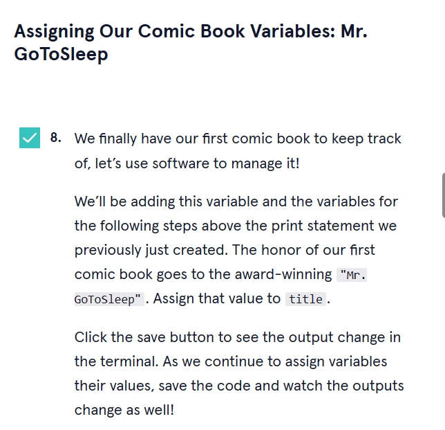
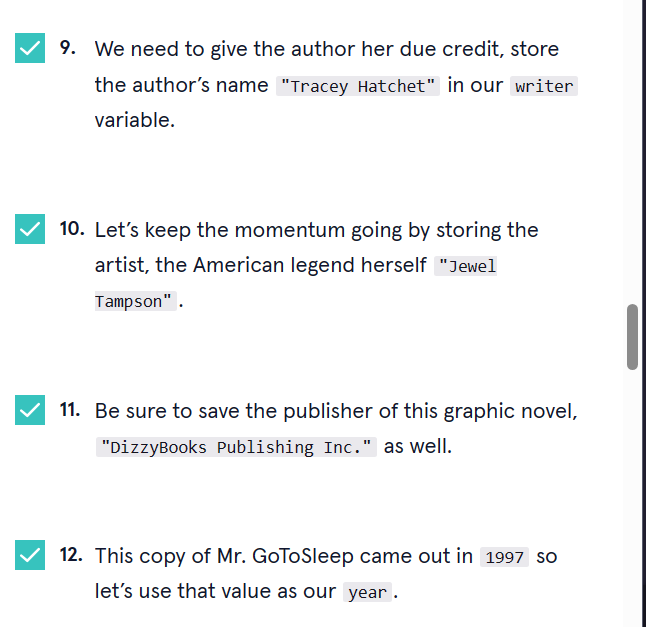
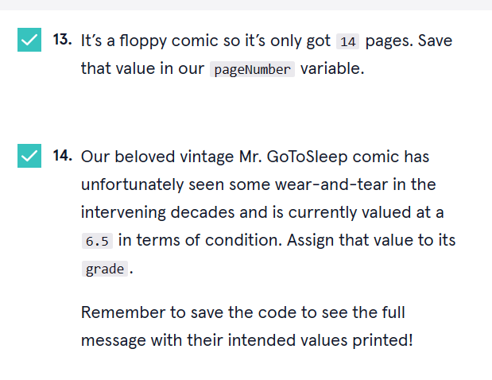
```go
 title = "Mr.GoToSleep"
  writer="Tracey Hatchet"
  artist="Jewel Tampson"
  publisher="DizzyBooks Publishing Inc."
  year=1997
  pageNumber=14
  grade=6.5
```

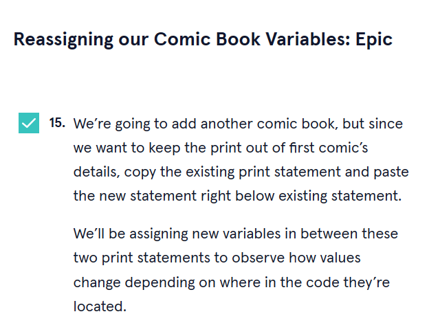
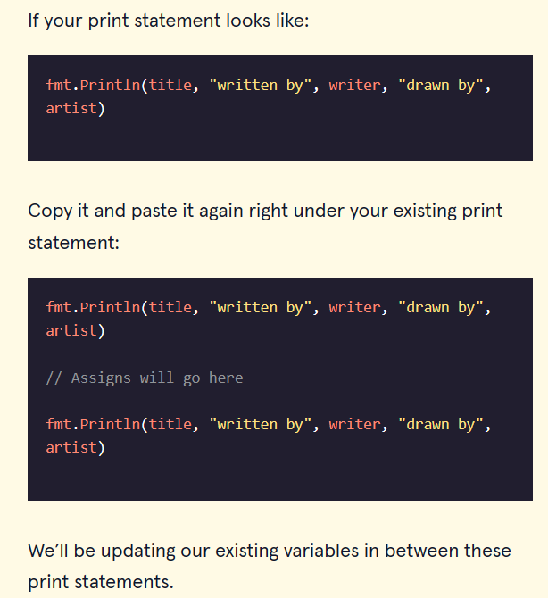
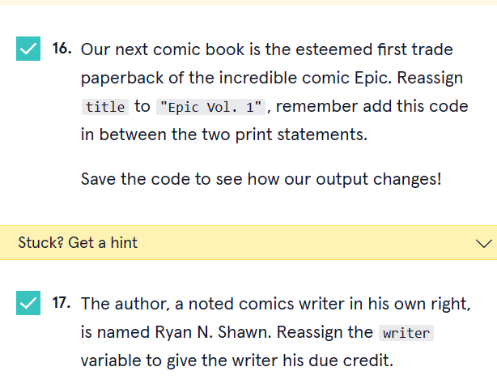
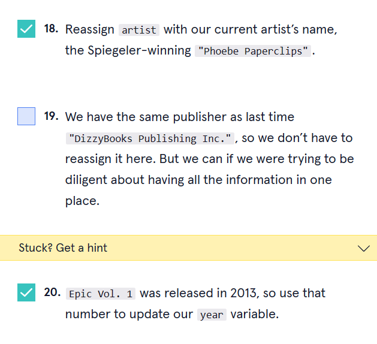
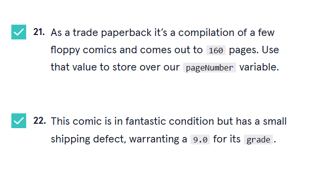
```go
  title = "Epic Vol. 1"
  writer="Ryan N. Shawn"
  artist="Phoebe Paperclips"
  year=2013
  pageNumber=160
  grade=9.0
  fmt.Println(title,"written by",writer,", drawn by",artist,", published by",publisher,"in",year,"with the number of",pageNumber,"pages","is scoring",grade)
```
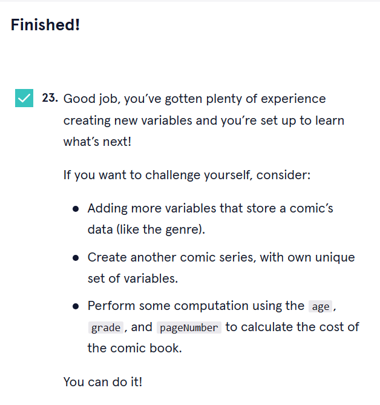