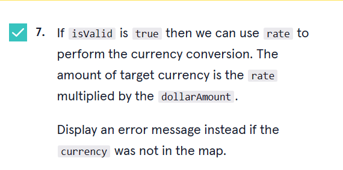

<a type="button" title="Codecademy_Learn_Go_Course_button" href="https://www.codecademy.com/courses/learn-go-loops-arrays-maps-and-structs/projects/currency-converter" target="_blank" data-CodecademyLearnGoCourseButt="CodecademyLearnGoCourseButt_data"></a>

<br><br>

# Currency Converter
<br>

# 1. Introduction:

<br>
<br>

# 2. Output:


<br>
<br>

# 3. Prompts:


```go
  currencies := map[string]float32{
    "JPY":130.2,
    "EUR":0.95,
  }
```


```go
var dollarAmount float32
var currency string
fmt.Println("Enter your dollar amount:")

fmt.Scan(&dollarAmount)
if dollarAmount == 0 {
    fmt.Println("Invalid amount")
}else{
    fmt.Println("Your amount is",dollarAmount)

}

fmt.Println("Enter your currency type:")

fmt.Scan(&currency)
```




```go
rate, isValid := currencies[currency]
if isValid {
    fmt.Printf("The amount of %v currency is $%f.\n",currency,rate*dollarAmount)
}else{
    fmt.Println(currency,"currency type was not in the map!")
}
```