<a type="button" title="Codecademy_Learn_Go_Course_button" href="https://www.codecademy.com/courses/learn-go-loops-arrays-maps-and-structs/projects/looping-through-a-food-order" target="_blank" data-CodecademyLearnGoCourseButt="CodecademyLearnGoCourseButt_data"></a>

<br><br>

# Food Order
<br>

# 1. Introduction:
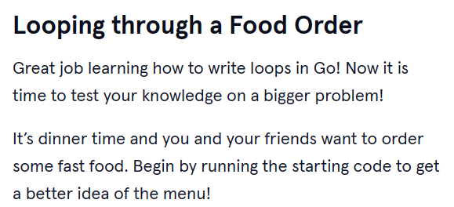
<br>
<br>

# 2. Output:
> $ go run order.go <br>
> The fast food menu has these items: [Burgers Nuggets Fries] 

> What would you like to eat: Burgers

> We have $14 remaining to be paid to the cashier and must hand a $2 bill to the cashier.

> We have $12 remaining to be paid to the cashier and must hand a $2 bill to the cashier.

> We have $10 remaining to be paid to the cashier and must hand a $2 bill to the cashier.

> We have $8 remaining to be paid to the cashier and must hand a $2 bill to the cashier.

> We have $6 remaining to be paid to the cashier and must hand a $2 bill to the cashier.

> We have $4 remaining to be paid to the cashier and must hand a $2 bill to the cashier.

> We have $2 remaining to be paid to the cashier and must hand a $2 bill to the cashier.

> The total for the order is 14
<br>
<br>

# 3. Prompts:

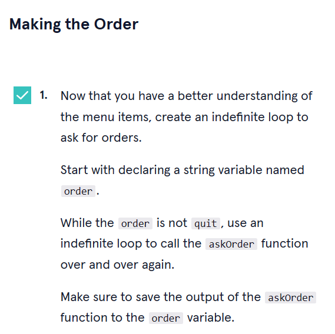
```go
//In 'main' function assign 'askOrder()' to 'order' variable
var order string = askOrder()


for order!="quit" {
  order=askOrder()
}
```

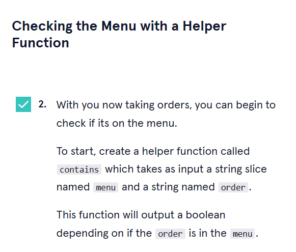
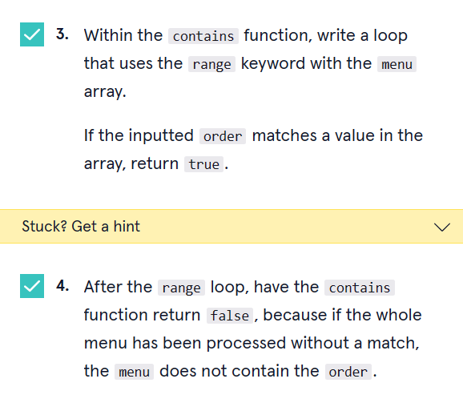
```go
func contains(menu []string,order string) bool {
  for index, value := range menu {
    if order == value {
      return true
    }
  }
  return false
}
//To make the program run correctly, we need to use another for loop through an array
func contains(menu []string,order string) bool {
 
  for i:=0; i<len(menu); i++{
    if order == menu[i] {
      return true
    }
  }
  return false
}

```


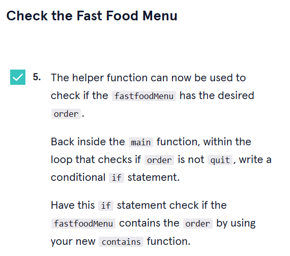
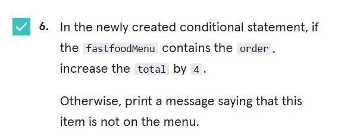
```go
for order!="quit" {
    if contains(fastfoodMenu, order){
        total+=4
        break
        //without 'break' this loop will run forever
    }else{
        fmt.Println("This item is not on the menu")
        order=askOrder()
    }
}
```
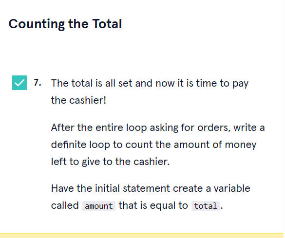
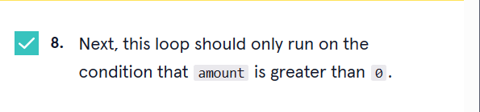
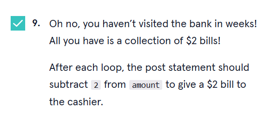
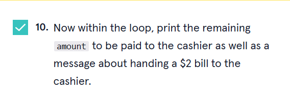
```go
for amount := total; amount >0; amount-=2 {
    fmt.Printf("We have $%d remaining to be paid to the cashier and must hand a $2 bill to the cashier.\n",amount)
}
```

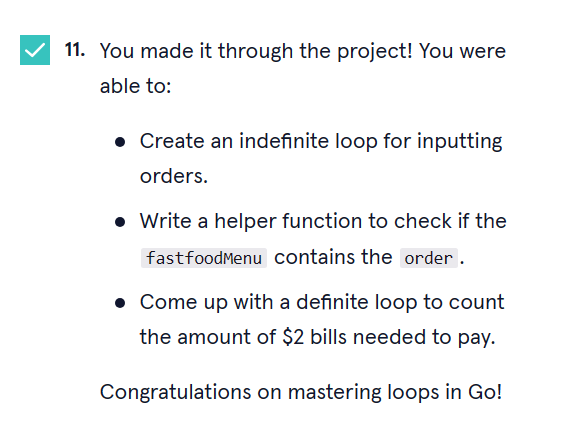