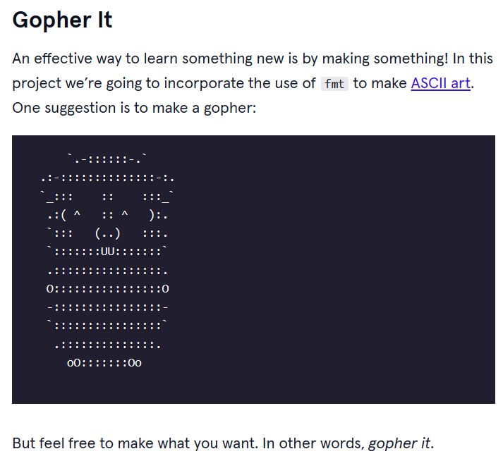
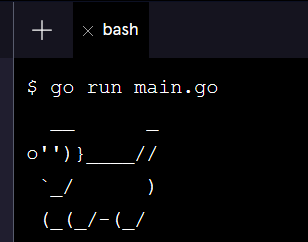
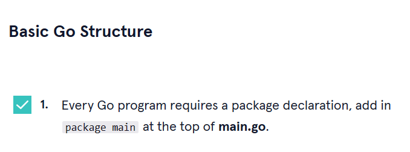
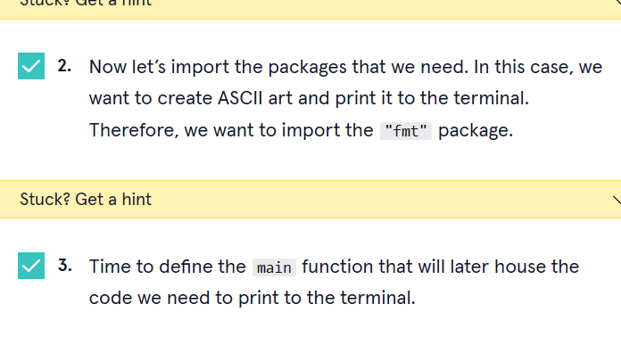
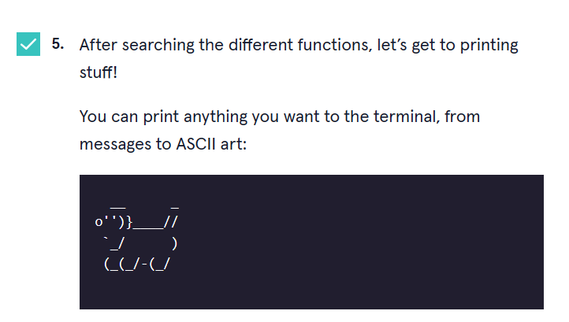
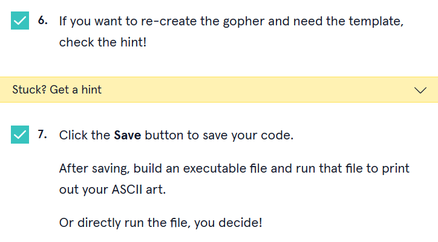
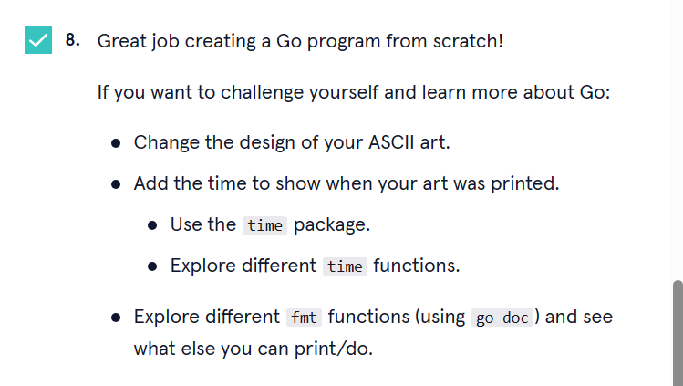

<a type="button" title="Codecademy_Learn_Go_Course_button" href="https://www.codecademy.com/courses/learn-go/projects/gopher-it" target="_blank" data-CodecademyLearnGoCourseButt="CodecademyLearnGoCourseButt_data"></a>

<br><br>

# Gopher It
<br>

# 1. Introduction:

<br>
<br>

# 2. Output:
> 

<br>
<br>

# 3. Prompts:


```go
package main
```


```go
import "fmt"

function main(){
  
}
```



```go
func main(){
  fmt.Println("  __      _")
  fmt.Println("o'')}____//")
  fmt.Println(" `_/      )")
  fmt.Println(" (_(_/-(_/")
}
```



