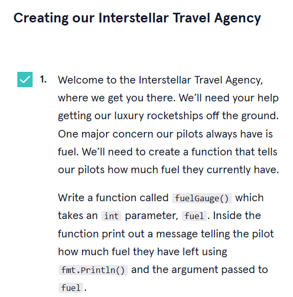

<a type="button" title="Codecademy_Learn_Go_Course_button" href="https://www.codecademy.com/courses/learn-go/projects/learn-go-functions-interstellar-travel" target="_blank" data-CodecademyLearnGoCourseButt="CodecademyLearnGoCourseButt_data"></a>

<br><br>

# Interstellar Travel
<br>

# 1. Introduction:

<br>
<br>

# 2. Output:
> 

<br>
<br>

# 3. Prompts:



```go
func fuelGauge(fuel int){
  fmt.Println("You have",fuel," fuel left")
}
```


```go
func calculateFuel(planet string) int{
  var fuel int
}
```


```go
func calculateFuel(planet string) int{
  var fuel int
  switch planet {
    case "Venus":
      fuel = 300000
    case "Mercury":
      fuel = 500000
    case "Mars":
      fuel = 700000
    default:
      fuel = 0
  }
  return fuel
}
```


```go
// Create the function greetPlanet() here
func greetPlanet(planet string){
  fmt.Println("Welcome to planet",planet)
}

// Create the function cantFly() here
func cantFly(){
  fmt.Println("We do not have the available fuel to fly there.")
}
```


```go
// Create the function flyToPlanet() here
func flyToPlanet(planet string, fuel int) int {
  var fuelRemaining, fuelCost int
  fuelRemaining = fuel
  fuelCost = calculateFuel(planet)

  if fuelRemaining >= fuelCost {
    greetPlanet(planet)
    fuelRemaining-=fuelCost
  }else{
    cantFly()
  }
  return fuelRemaining
}
```


```go
func main() {
  // Test your functions!
  
  // Create `planetChoice` and `fuel`
  var fuel int = 1000000
  planetChoice := "Venus"

  fuel = flyToPlanet(planetChoice,fuel)
  fuelGauge(fuel)
  // And then liftoff!
  
}
```


