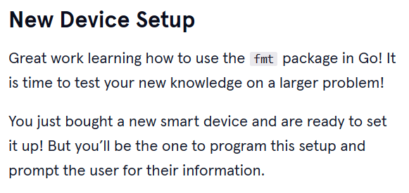
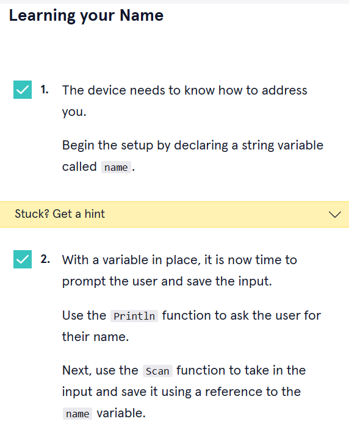
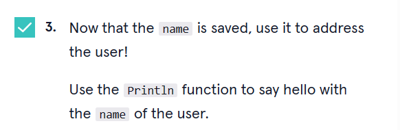
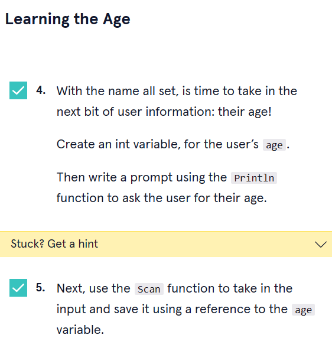
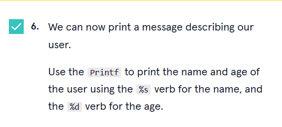
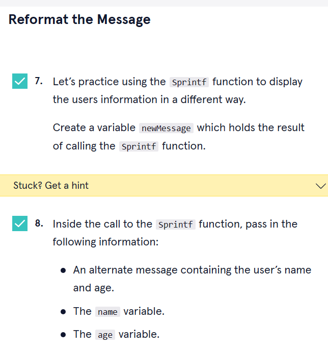
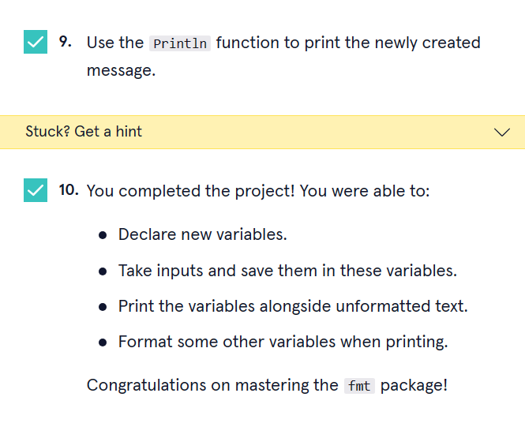

<a type="button" title="Codecademy_Learn_Go_Course_button" href="https://www.codecademy.com/courses/learn-go/projects/new-device-setup-with-go-fmt" target="_blank" data-CodecademyLearnGoCourseButt="CodecademyLearnGoCourseButt_data"></a>

<br><br>

# New Device Setup
<br>

# 1. Introduction:

<br>
<br>

# 2. Output:
> 


<br>
<br>

# 3. Prompts:



```go
var name string
  fmt.Println("What's your name?")
  fmt.Scan(&name)
  fmt.Printf("Hello %s!!!\n",name)

```



```go
 var age int
  fmt.Println("What's your age?")
  fmt.Scan(&age)
  fmt.Printf("Age: %d.\n",age)
```



```go
newMessage:=fmt.Sprintf("Name: %s. Age: %d",name,age)
fmt.Println(newMessage)

```