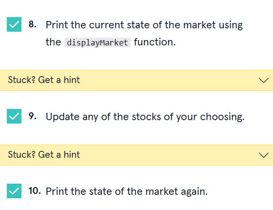

<a type="button" title="Codecademy_Learn_Go_Course_button" href="https://www.codecademy.com/courses/learn-go-loops-arrays-maps-and-structs/projects/stock-market-golang" target="_blank" data-CodecademyLearnGoCourseButt="CodecademyLearnGoCourseButt_data"></a>

<br><br>

# Stock Market
<br>

# 1. Introduction:

<br>
<br>

# 2. Output:
> Stock: GOOG . Price: 2313.5

> Stock: AAPL . Price: 157.28

> Stock: FB . Price: 203.77

> Stock: TWTR . Price: 50

> *Update 1:*

> Stock: GOOG . Price: -3117.17

> Stock: AAPL . Price: 157.28

> Stock: FB . Price: 203.77

> Stock: TWTR . Price: 50

> *Update 2:*

> Stock: GOOG . Price: -3117.17

> Stock: AAPL . Price: -3836.227

> Stock: FB . Price: 203.77

> Stock: TWTR . Price: 50


<br>
<br>

# 3. Prompts:

```go
type Stock struct {
  name string
  price float32
}
```


```go
func (stock *Stock) updateStock() {
  change:=randomNumberGen(-10000,10000)
  stock.price=change
}
```


```go
func displayMarket(market []Stock){
  for i:=0; i<len(market); i++ {
    fmt.Println("Stock:",market[i].name,". Price:",market[i].price)
  }
}
```



```go
 stockMarket := []Stock{{"GOOG",2313.50},{"AAPL",157.28},{"FB",203.77},{"TWTR",50.00}}
 // Function calls go here
  displayMarket(stockMarket)
 //update1
  fmt.Println("*Update 1:*")
  stockMarket[0].updateStock()
  displayMarket(stockMarket)
  //update2
   fmt.Println("*Update 2:*")
  stockMarket[1].updateStock()
  displayMarket(stockMarket)
```